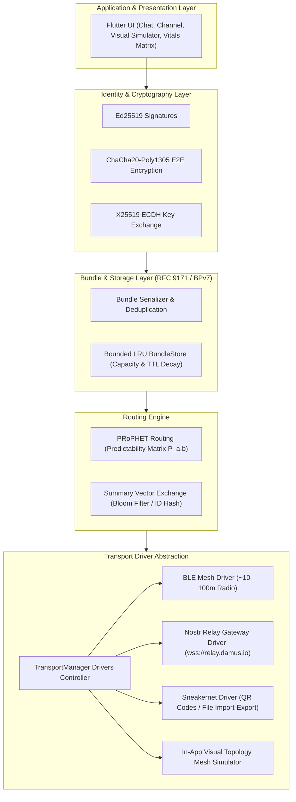

# Resilient Mesh Messenger — Multi-Transport DTN Architecture

[](https://flutter.dev)
[](https://dart.dev)
[](LICENSE)
[](.github/workflows/build_release.yml)
[](https://github.com/Zcross091)

> **Mesh Messenger** is a resilient, offline-first mobile messaging application built on Flutter. Operating as a **Delay/Disruption-Tolerant Network (DTN)** based on **RFC 9171 (BPv7)**, it replaces brittle real-time connection requirements with opportunistic store-and-forward bundle routing across multiple transport drivers (BLE Mesh, Nostr Internet Gateways, and Sneakernet QR/Files).

---

## 📌 Executive Summary

Traditional peer-to-peer mesh messengers fail when an unbroken physical radio path between sender and recipient is unavailable at the moment of transmission. **Mesh Messenger** solves this link-breakage problem by shifting from packet-switched routing to a **Delay/Disruption-Tolerant Network (DTN)** architecture:

- **Store-and-Forward**: Messages are serialized into self-contained, cryptographically signed and encrypted **Bundles**.
- **Transport Agnostic**: Bundles hop seamlessly across short-range radio (BLE), global Nostr WebSocket relays, and physical media (QR codes / USB drives).
- **Epidemic & PRoPHET Routing**: Peer encounters build statistical delivery predictability matrices ($P_{a,b}$) to route bundles toward peers most likely to reach the target destination.

---

## 📐 System Architecture



---

## ✨ Key Features

- **Multi-Transport Multiplexing**: Broadcasts bundles across all active radio and internet interfaces simultaneously.
- **End-to-End Encryption (E2EE)**: Payloads are encrypted using **ChaCha20-Poly1305** and authenticated with **Ed25519** keypairs before touching any transport layer.
- **Self-Contained Bundles (RFC 9171)**: Each bundle carries its own TTL, hop counter, priority flag, and deduplication ID (`hash(sender_pubkey || nonce)`).
- **PRoPHET Routing Engine**: Implements probabilistic delivery scoring ($P_{a,b}$) to eliminate unnecessary broadcast storms while maximizing delivery probability.
- **Nostr Relay Bridge**: Bridges isolated offline local meshes over the internet using custom Nostr protocol event kinds (`Kind 20000`).
- **In-App Visual Mesh Simulator**: Real-time canvas to drag nodes, simulate node outages, and observe store-and-forward bundle propagation in real time.

---

## 📄 Bundle Specification (RFC 9171 Adaptation)

```text
Bundle {
  bundle_id:        String (SHA-256 hash of sender_pubkey + nonce)
  sender_pubkey:    String (Ed25519 Public Key Hex)
  dest_pubkey:      String (Recipient Public Key Hex or 'all')
  created_at:       int (Unix Epoch Milliseconds)
  ttl_seconds:      int (Time-To-Live duration)
  hop_count:        int (Hop Counter, incremented per forward)
  priority:         enum { low, normal, high }
  payload:          String (Encrypted Ciphertext Base64)
  signature:        String (Ed25519 Signature Hex)
}
```

---

## 🛠️ Repository Structure

```text
Mesh Messenger/
├── .github/
│   └── workflows/
│       └── build_release.yml   # CI/CD Workflow for Android APK & Web releases
├── lib/
│   ├── main.dart              # Application entry point & driver initialization
│   ├── core/
│   │   ├── crypto/            # Ed25519 & ChaCha20-Poly1305 engine
│   │   ├── models/            # DTN Bundle data model (RFC 9171)
│   │   ├── routing/           # PRoPHET routing & encounter matrix
│   │   └── storage/           # Bounded LRU store with TTL pruning
│   ├── transports/            # Pluggable transport drivers
│   │   ├── ble_transport.dart
│   │   ├── nostr_gateway_transport.dart
│   │   ├── simulator_transport.dart
│   │   ├── sneakernet_transport.dart
│   │   └── transport_manager.dart
│   └── ui/                    # Flutter UI & theme components
│       ├── screens/           # Chat, Identity, Network, & Simulator screens
│       └── theme/             # Modern dark mode theme system
├── test/                      # Unit & protocol verification tests
│   ├── bundle_test.dart
│   ├── crypto_test.dart
│   └── routing_test.dart
└── pubspec.yaml               # Package manifest & dependencies
```

---

## 🚀 Getting Started & Local Development

### Prerequisites
- **Flutter SDK**: `3.19.x` or higher
- **Dart SDK**: `3.4.x` or higher
- **Java JDK**: `17` (for Android builds)

### 1. Clone & Fetch Dependencies
```bash
git clone https://github.com/Zcross091/Better-BitChat.git
cd Better-BitChat
flutter pub get
```

### 2. Run Protocol Verification Tests
```bash
flutter test
```

### 3. Launch App Locally
```bash
# Launch on connected mobile device or emulator
flutter run
```

---

## ⚙️ Automated CI/CD Pipeline

The project includes an automated GitHub Actions pipeline ([.github/workflows/build_release.yml](file:///.github/workflows/build_release.yml)):

- **Triggers**: Automated build on push to `main` or `master` branches, tag pushes (`v*`), or manual execution.
- **Build Pipeline**:
  1. Compiles release binaries for **Android (APK)**.
  2. Generates standalone **Web Release Bundles**.
  3. Executes unit and routing test suites automatically.
  4. Publishes a versioned **GitHub Release** attached with runnable artifacts.

---

## ⚖️ Security Model

1. **Zero Trust Relays**: Intermediate relay nodes (phones, field boxes, or public Nostr servers) only inspect routing headers (`bundle_id`, `ttl`, `dest_pubkey`). Payload contents remain fully encrypted end-to-end.
2. **Anti-Replay & Deduplication**: Summary vector handshakes prevent double-forwarding and infinite loop proliferation.
3. **Cryptographic Signatures**: All bundles are signed by the sender's Ed25519 private key to ensure non-repudiation and origin verification.

---

## 👤 Author & Support

Developed and maintained by **StateCraft** ([@Zcross091](https://github.com/Zcross091)).

- **GitHub Repository**: [Zcross091/Better-BitChat](https://github.com/Zcross091/Better-BitChat)
- **Support Email**: `robinw091@gmail.com`

---

## 📜 License

This project is licensed under the [MIT License](LICENSE).
