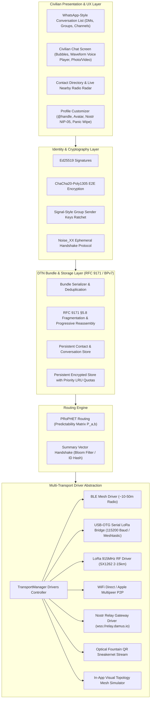

# Resilient Mesh Messenger — Civilian WhatsApp Competitor & Multi-Transport DTN Architecture

[](https://flutter.dev)
[](https://dart.dev)
[](LICENSE)
[](.github/workflows/build_release.yml)
[](https://github.com/Zcross091)

> **Mesh Messenger** is a consumer-grade, privacy-first, offline-resilient messaging platform designed for everyday civilians and disaster response teams. Operating as a **Delay/Disruption-Tolerant Network (DTN)** based on **RFC 9171 (BPv7)**, it combines the familiar, rich UX of **WhatsApp and Signal** (Direct Messages, Private Groups, Custom `@handles`, Photos, Video Clips, Voice Notes with Waveforms, Emoji Reactions, and Delivery Ticks) with an unbreakable, off-grid multi-transport engine (BLE Mesh, LoRa 915MHz SX1262, USB-OTG Serial, WiFi Direct, Nostr Internet Relays, and Fountain QR Sneakernet).

---

## 📌 Executive Summary & WhatsApp Comparison

| Feature | WhatsApp / Signal | Standard Tactical Mesh | **Mesh Messenger** |
|---|---|---|---|
| **Blackout / Off-Grid Resilient** | ❌ (Fails without internet) | ⚠️ (Brittle real-time link) | ✅ **100% Offline DTN Store-and-Forward** |
| **Global Internet Chat** | ✅ (Centralized servers) | ❌ (Local radio only) | ✅ **Decentralized Nostr Relays (`damus.io`)** |
| **Phone Number / Account Free** | ❌ (Phone number required) | ⚠️ (Raw 64-char hex key) | ✅ **Custom `@username`, Display Names, Bios, Avatars** |
| **Direct Messaging (DMs)** | ✅ | ⚠️ (Basic 1-to-1) | ✅ **End-to-End Encrypted DMs with Delivery Receipts** |
| **Private Group Chats** | ✅ | ❌ (Broadcast only) | ✅ **Encrypted Groups via Signal-Style Sender Keys** |
| **Multimedia Suite** | ✅ | ❌ (Text only) | ✅ **Photos, Video Clips, Voice Notes (Waveforms), Geo-Pins** |
| **Message Reactions & Replies** | ✅ | ❌ | ✅ **Emoji Reactions (👍❤️😂😮😢🙏) & Quoted Replies** |
| **Contact Search & Directory** | ✅ | ❌ | ✅ **Instant Search by Handle, Name, or Key** |
| **Anti-Forensic OpSec** | ❌ | ❌ | ✅ **Duress Mode, Panic Wipe, Flash Memory Sanitization** |

---

## 📐 System Architecture



---

## ✨ Key Civilian Capabilities

1. **Custom Handles & Civilian Profiles**: Customize your `@username`, display name, bio, and avatar color seed without ever providing a phone number or email address. Optional Nostr NIP-05 handle resolution (`user@mesh.nostr`).
2. **Direct Messaging (DMs) with Delivery Receipts**: End-to-end encrypted 1-on-1 conversations with WhatsApp-style delivery tick marks (🕒 Pending, ✓ Stored in Mesh, ✓✓ Forwarded, ✓✓ Blue Read).
3. **Private Multi-Party Groups**: Create private group chats (e.g. *#family*, *#neighborhood-relief*, *#hiking-squad*) encrypted with **Signal-style Group Sender Keys** ensuring forward secrecy.
4. **Rich Multimedia Suite**:
   - **Voice Notes**: Interactive audio bubbles with animated waveform visualization bars and play/pause scrubbers.
   - **Photos & Videos**: Compressed image thumbnails with full-screen zoom and video clips with progressive micro-fragment reassembly.
   - **Tactical Geo-Pins & SOS**: Real-time GPS coordinate sharing with emergency severity demarcation.
5. **Emoji Reactions & Quoted Replies**: Long-press on any message to react with emojis (`👍`, `❤️`, `😂`, `😮`, `😢`, `🙏`) or create quoted reply threads.
6. **Address Book & Nearby Radio Radar**: Instant contact search by name or `@handle`, plus real-time radar detecting nearby physical mesh nodes across Bluetooth Low Energy, LoRa 915MHz, and WiFi Direct.
7. **Anti-Forensic Security & Panic Wipe**: One-tap emergency panic wipe that irreversibly purges private keys, contact lists, and message caches from flash memory.

---

## 🛠️ Repository Structure

```text
Mesh Messenger/
├── .github/
│   └── workflows/
│       └── build_release.yml   # CI/CD Workflow for Android APK & Web releases
├── lib/
│   ├── main.dart              # Application entry point & 5-tab consumer navigation
│   ├── core/
│   │   ├── crypto/            # Ed25519, ChaCha20, Group Sender Keys, Fountain QR, Noise
│   │   ├── hardware/          # SerialPortDriver (UART 115200) & MeshtasticInterop
│   │   ├── models/            # UserProfile, Contact, Conversation, ChatMessage, Bundle
│   │   ├── routing/           # PRoPHET router & FragmentationEngine
│   │   └── storage/           # ContactStore & PersistentBundleStore
│   ├── transports/            # Pluggable transport drivers
│   │   ├── ble_transport.dart
│   │   ├── lora_transport.dart
│   │   ├── usb_serial_lora_transport.dart
│   │   ├── wifi_direct_transport.dart
│   │   ├── nostr_gateway_transport.dart
│   │   ├── simulator_transport.dart
│   │   ├── sneakernet_transport.dart
│   │   └── transport_manager.dart
│   └── ui/                    # Consumer UI & theme components
│       ├── screens/           # ConversationsList, CivilianChat, Contacts, Network, Profile
│       ├── widgets/           # CreateGroupDialog, Fountain QR Dialog, Hardware Console
│       └── theme/             # Modern dark mode theme system
├── test/                      # Unit & protocol verification test suites (12 Suites)
│   ├── bundle_test.dart
│   ├── civilian_models_test.dart
│   ├── contact_store_test.dart
│   ├── crypto_test.dart
│   ├── fountain_qr_test.dart
│   ├── fragmentation_test.dart
│   ├── group_sender_key_test.dart
│   ├── lora_transport_test.dart
│   ├── meshtastic_interop_test.dart
│   ├── persistent_store_test.dart
│   ├── routing_test.dart
│   └── serial_driver_test.dart
└── pubspec.yaml               # Package manifest & dependencies
```

---

## 🚀 Getting Started & Local Development

### Prerequisites
- **Flutter SDK**: `3.19.x` or higher
- **Dart SDK**: `3.4.x` or higher
- **Java JDK**: `17` (for Android builds)

### 1. Clone & Fetch Dependencies
```bash
git clone https://github.com/Zcross091/Better-BitChat.git
cd Better-BitChat
flutter pub get
```

### 2. Run All 12 Automated Test Suites
```bash
flutter test
```

### 3. Launch App Locally
```bash
# Launch on connected mobile device or emulator
flutter run
```

---

## 👤 Author & Support

Developed and maintained by **StateCraft** ([@Zcross091](https://github.com/Zcross091)).

- **GitHub Repository**: [Zcross091/Better-BitChat](https://github.com/Zcross091/Better-BitChat)
- **Support Email**: `robinw091@gmail.com`

---

## 📜 License

This project is licensed under the [MIT License](LICENSE).
