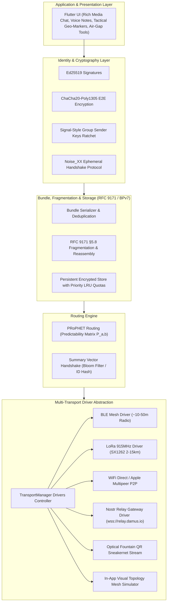

# Resilient Mesh Messenger — Multi-Transport DTN Architecture

[](https://flutter.dev)
[](https://dart.dev)
[](LICENSE)
[](.github/workflows/build_release.yml)
[](https://github.com/Zcross091)

> **Mesh Messenger** is a resilient, offline-first mobile messaging application built on Flutter. Operating as a **Delay/Disruption-Tolerant Network (DTN)** based on **RFC 9171 (BPv7)**, it replaces brittle real-time connection requirements with opportunistic store-and-forward bundle routing across multiple transport drivers (BLE Mesh, LoRa 915MHz Radio, WiFi Direct P2P, Nostr Internet Gateways, and Sneakernet Fountain QR).

---

## 📌 Executive Summary

Traditional peer-to-peer mesh messengers fail when an unbroken physical radio path between sender and recipient is unavailable at the moment of transmission. **Mesh Messenger** solves this link-breakage problem by shifting from packet-switched routing to a **Delay/Disruption-Tolerant Network (DTN)** architecture:

- **Store-and-Forward**: Messages are serialized into self-contained, cryptographically signed and encrypted **Bundles**.
- **Transport Agnostic**: Bundles hop seamlessly across short-range radio (BLE), long-range companion radio (LoRa 915MHz), high-speed local P2P (WiFi Direct), global Nostr WebSocket relays, and physical media (Animated Fountain QR codes).
- **RFC 9171 §5.8 Fragmentation**: Payloads exceeding transport MTUs (e.g. 200 bytes for LoRa) are automatically sliced into micro-fragments and progressively reassembled out-of-order upon arrival.
- **Group Sender Keys & Noise Protocol**: Signal-style $O(1)$ multi-party group encryption with ratcheting forward secrecy.
- **Persistent Encrypted Storage**: Hardware-keyed at-rest bundle store with priority-aware LRU cache eviction (protecting Emergency SOS payloads).

---

## 📐 System Architecture



---

## ✨ Key Capabilities

- **Multi-Transport Multiplexing**: Broadcasts bundles across all active radio and internet interfaces simultaneously.
- **LoRa Radio Companion Integration**: Connects with Meshtastic / Heltec ESP32 SX1262 LoRa modules (SF7–SF12, 915MHz) for long-range city-scale mesh communication.
- **WiFi Direct Burst Link**: High-throughput local rendezvous channel for rapid multi-megabyte bundle exchange.
- **Rich Media DTN Payloads**: Supports text, Opus compressed voice notes, reconnaissance photos, and emergency GPS geo-markers.
- **Optical Air-Gap Fountain QR Stream**: Rapid cycling animated QR droplets (8–12 fps) for transferring multi-kilobyte bundles camera-to-screen without radio emissions.
- **PRoPHET Routing Engine**: Probabilistic delivery scoring ($P_{a,b}$) to route bundles toward peers statistically likely to reach the target destination.

---

## 🛠️ Repository Structure

```text
Mesh Messenger/
├── .github/
│   └── workflows/
│       └── build_release.yml   # CI/CD Workflow for Android APK & Web releases
├── lib/
│   ├── main.dart              # Application entry point & driver initialization
│   ├── core/
│   │   ├── crypto/            # Ed25519, ChaCha20, Group Sender Keys, Fountain QR, Noise
│   │   ├── models/            # Bundle, BundleFragment (RFC 9171), MediaPayload
│   │   ├── routing/           # PRoPHET router & FragmentationEngine
│   │   └── storage/           # PersistentBundleStore with priority LRU quotas
│   ├── transports/            # Pluggable transport drivers
│   │   ├── ble_transport.dart
│   │   ├── lora_transport.dart
│   │   ├── wifi_direct_transport.dart
│   │   ├── nostr_gateway_transport.dart
│   │   ├── simulator_transport.dart
│   │   ├── sneakernet_transport.dart
│   │   └── transport_manager.dart
│   └── ui/                    # Flutter UI & theme components
│       ├── screens/           # Chat, Identity, Network, & Simulator screens
│       ├── widgets/           # Animated Fountain QR Dialogs & controls
│       └── theme/             # Modern dark mode theme system
├── test/                      # Unit & protocol verification test suites
│   ├── bundle_test.dart
│   ├── crypto_test.dart
│   ├── fountain_qr_test.dart
│   ├── fragmentation_test.dart
│   ├── group_sender_key_test.dart
│   ├── lora_transport_test.dart
│   ├── persistent_store_test.dart
│   └── routing_test.dart
└── pubspec.yaml               # Package manifest & dependencies
```

---

## 🚀 Getting Started & Local Development

### Prerequisites
- **Flutter SDK**: `3.19.x` or higher
- **Dart SDK**: `3.4.x` or higher
- **Java JDK**: `17` (for Android builds)

### 1. Clone & Fetch Dependencies
```bash
git clone https://github.com/Zcross091/Better-BitChat.git
cd Better-BitChat
flutter pub get
```

### 2. Run Protocol Verification Tests (8 Test Suites)
```bash
flutter test
```

### 3. Launch App Locally
```bash
# Launch on connected mobile device or emulator
flutter run
```

---

## 👤 Author & Support

Developed and maintained by **StateCraft** ([@Zcross091](https://github.com/Zcross091)).

- **GitHub Repository**: [Zcross091/Better-BitChat](https://github.com/Zcross091/Better-BitChat)
- **Support Email**: `robinw091@gmail.com`

---

## 📜 License

This project is licensed under the [MIT License](LICENSE).
